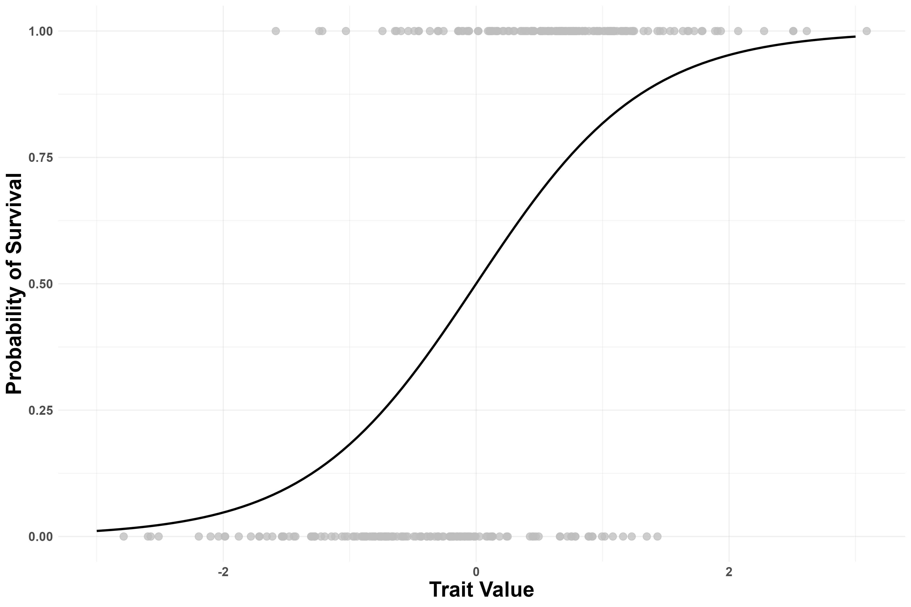
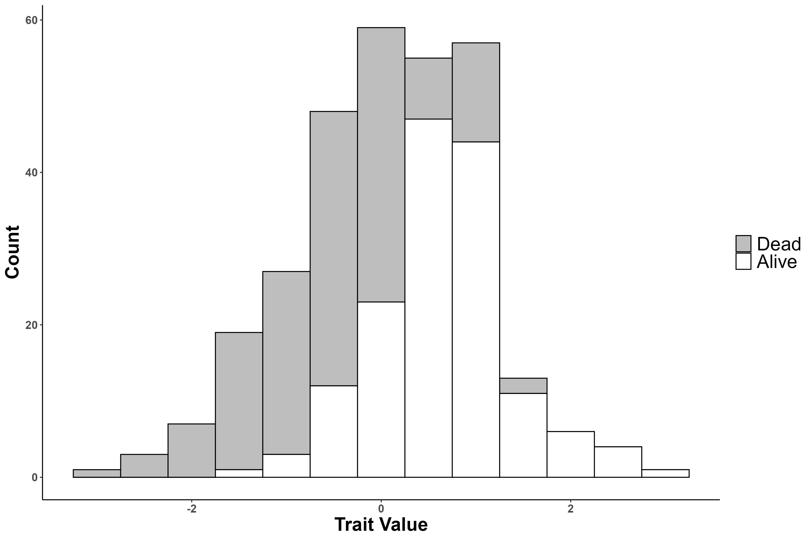

# Testing for selection.

Recall Darwin's postulates of natural selection from your reading and lecture:

1.  There must be variation for a trait in the population.
2.  There must be variation in survival and/or reproduction
3.  There must be a relationship between survival/reproduction and the trait.
4.  Differences between individuals must be at least partially heritable

To demonstrate that natural selection is changing a trait in a population, all of these postulates must be met. Below I have simulated a trait and survival of individuals in a population. @fig-survival plots individual trait values and whether or not they survived. Grey dots are individual trait values on the x-axis. If they survived, they have a value of 1 on the y-axis and a value of 0 if they died. The line shows the actual function relating the trait to survival (we know it here because I simulated it, but we unfortunately can't know the true function in real populations, but have to infer it from data).

@fig-stacked_hist is a stacked histogram which shows the distributions of the overall population before selection (grey and white combined) vs. the distribution of the survivors (white). Break up into your groups, spend a couple minutes thinking and chatting about the figures, then answer question 1 below. This first question won't be graded based on correctness but effort.\
\

### Question 1

Go through each of Darwin's postulates and discuss how the figures provide evidence (or lack of evidence) for each. Based on your discussion, do you think natural selection will change this population? If yes, how? If no, why not?\
\
\
\

{#fig-survival width="80%"}

{#fig-stacked_hist width="80%"}

# Simulating Natural Selection

Let's pretend we have a species of plants that can be from 1cm to 20cm tall. We are going to simulate a bunch of plants using a d20 die. If you are cool enough to have one handy, grab it. If you, like me, don't have one, just Google d20 simulator and it will be easy to find. We will first simulate a plant with a roll of the die, this gives us the height of the plant. Each student will simulate 10 plants and enter it into the **Plant Size** column in the shared Google sheet.

Next we will simulate a pair of herbivores that eat our plants. The first herbivore prefers small plants. We will use a d10 (find with Google again if you don't have one). For every plant, simulate the size preference of the small herbivore and enter it into the **Small Herbivore** column in the Google Sheet.

Now we will simulate the preference of the large herbivore. Use the same d10 but add 10 to the roll (e.g. if you roll a 1, you will enter 11). Enter your large herbivore's preference into the **Large Herbivore** column.

Finally, we will see if our plant lived or died. If your plant was larger than the small herbivore's preference **AND** smaller than the large herbivore's preference, your plant survived! Enter a *1* into the **Survive** column. If your plant is smaller (or equal to) the small herbivore's preference, it got eaten, likewise if it is bigger (or equal to) the big herbivore's preference: enter *0* into the **Survive** column.

We are now going to make versions of @fig-survival and @fig-stacked_hist with our simulated population. To create the survival plot, first calculate the proportion of individuals of each size that survived. Then plot proportion survived on the y-axis and plant size on the x-axis. Finally, just connect the dots (no need to do a statistical analysis here). 

For the stacked histogram, count how many individuals survived in each size and draw a bar. Then count how many died and draw a bar of that height on top of the alive bar (make sure to have different colors and indicate that in the legend). Use any software that you like to make the figures. You can also draw it out by hand on the computer or a piece of paper and paste an image into the assignment. Once you've made the plots, there is a short answer question asking you to interpret how you think selection will change our population of simulated plants.

### Question 2

Draw a plot similar to @fig-survival for our simulated data.\
\
\
\
\

### Question 3

Draw a stacked histogram similar to @fig-stacked_hist for our simulated data.\
\
\
\
\

### Question 4

What is the selection differential (the mean of the selected population minus the mean of the original population)? Has selection changed our plant population?\
\
\
\
\

To make things more confusing, selection doesn't always act on the raw trait values themselves (by changing the mean). Sometimes selection acts on the distances that the traits are from some favored/disfavored value (we will develop a vocabulary for talking about this over the course). Let's redo question 2 but instead of plotting the raw trait value, let's plot the squared distance from the population mean of 10.5. To do this, create a column in the Google sheet for this distance. Take the plant's size, subtract 10.5 and square the result. For example $(1-10.5)^2=(20-10.5)^2=90.25$. Calculate the proportion survived for these new values and remake the plot from question 2.

### Question 5

Plot proportion survived as a function of squared distance from the mean.\
\
\
\
\

### Question 6

Compare this to the outcome from questions 2 and 3, how does it differ? Can you give a biological explanation?\
\
\
\
\

When completed, please save as a pdf and submit to Brightspace.

